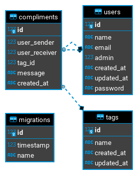

# NLW Valoriza
## 🚀 Techs used in this Project:

- [Node.js](https://nodejs.org/en/)
- [TypeScript](https://www.typescriptlang.org/)
- [Typeorm](https://typeorm.io/#/)
- [Express](https://expressjs.com/)
- [Jest](https://jestjs.io/)
- [Supertest](https://github.com/visionmedia/supertest)

## 💻 Introduction

- This project was developed in the `Next Level Week 06` event. In this event, we built a API to create and send compliments to users of a given Company. This api is capable of:
  - Create `USERS`
  - Edit user data
  - Edit user password
  - Log in with registered users
  - Delete `USERS` from database
  - create `TAGS` to store all the compliments made from users
  - Delete `TAGS` and all the compliments from this tag
  - Create `COMPLIMENTS` to users, which have to be linked to a given `TAG`
  - Delete `COMPLIMENTS`

## API Documentation:

- You can check all the API documentation on the following link: https://8bitbeard.github.io/nodejs_nlw_valoriza/#/
  - This link was hosted on github-pages, following the awesome tutorial from this repository: https://github.com/peter-evans/swagger-github-pages

## Unit Test Coverage:

- This project was also used to study about Code test coverage (Unit testing and integration testing). The files of the following folders were fully covered by unit testing:
  - src/controllers
  - src/entities
  - src/repositories
  - src/services
- You can check the default coverage report generated by Jest on the following link: https://8bitbeard.github.io/nodejs_nlw_valoriza/coverage/lcov-report/

## Business Rules

- User Authentication
  - :heavy_check_mark: should be able to authenticate with a normal user with valid credentials
  - :heavy_check_mark: should be able to authenticate with a admin user with valid credentials
  - :heavy_check_mark: should not be able to authenticate with a invalid email adress
  - :heavy_check_mark: should not be able to authenticate with a invalid admin user password
  - :heavy_check_mark: should not be able to authenticate with a invalid normal user password

- User Register
  - :heavy_check_mark: should be able to create a new admin user
  - :heavy_check_mark: should be able to create a normal user
  - :heavy_check_mark: should be able to create a user without the admin parameter
  - :heavy_check_mark: should not be able to create a user without the email parameter
  - :heavy_check_mark: should not be able to create a user without the password paramete
  - :heavy_check_mark: should not be able to create a user with an existing email
  - :heavy_check_mark: should not be able to create a user with a password with letters or special character
  - :heavy_check_mark: should not be able to create a user with a password that has more than 4 digit
  - :heavy_check_mark: should not be able to create a user with a password that has less than 4 digits

- Tag Creation
  - :heavy_check_mark: It iw not allowed to create more than one tag with the same name
  - :heavy_check_mark: It is not allowed to create a tag without a name
  - :heavy_check_mark: Tags can only be created by a admin user
  - :heavy_check_mark: It is necessary to log in on the application to create tags
  - Tags can only have 50 chars max

- Compliments Creation
  - :heavy_check_mark: A user can not create a compliment to himself
  - :heavy_check_mark: It is not allowed to create compliments to invalid/inexistent users
  - :heavy_check_mark: It is necessary to log in on the application to create compliments

- Password Reset
  - :heavy_check_mark: It is necessary to log in on the application to reset the password
  - :heavy_check_mark: A user can only change his password
  - The password can only contain numbers
  - The password must have a size of 4 numbers

- User Data Update
  - :heavy_check_mark: Only a admin user can update a user data
  - A admin can change his own data

- Delete User
  - :heavy_check_mark: Only a admin user can delete users
  - A user cant delete himself

## Database table diagram:

